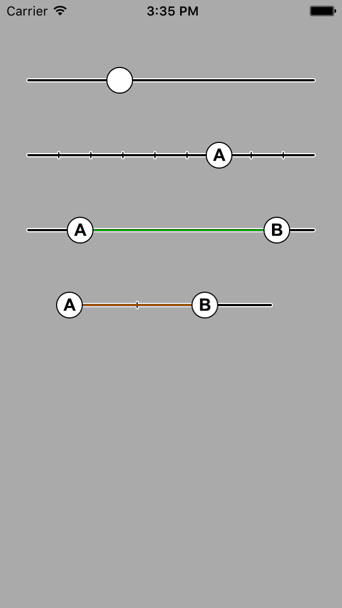

# Swift Components - PowerSlider

 ________
 

### PowerSlider

A range slider which has the following features:

* Large paddle touch area for "fat fingers"
* Snappable slider positions with "snap points"
* Range slider - a dual slider which enables a range between two draggable paddles to be selected
* Customisable slider graphics for slider track, paddle and track snap points
* Delegate protocol 

To create a PowerSlider import the PowerSlider folder into your project, construct a PowerSider and use the method:

		func createSlider(myName:String, size:CGRect, snapPoints:Int, 
					        dualSlider:Bool? = false,
					        minValue:CGFloat? = 0,
					        maxValue:CGFloat? = 100,
					        startValueA:CGFloat? = 0,
					        startValueB:CGFloat? = 100,
					        trackPaintColor:UIColor? = UIColor.greenColor(),
					        paddleGraphicA:UIImage? = UIImage(named: "paddle-a")!,
					        paddleGraphicB:UIImage? = UIImage(named: "paddle-b")!,
					        trackAssetLeft:UIImage? = UIImage(named: "track-left")!,
					        trackAssetRight:UIImage? = UIImage(named: "track-right")!,
					        trackAssetMiddle:UIImage? = UIImage(named: "track-middle")!,
					        trackAssetSnapPoint:UIImage? = UIImage(named: "track-snap-point")!) 
					        
					        
		
Note the optionals which you can use to define a dual slider (which uses paddle concepts A&B as opposed to a singular "A"), min & max values, the start values for any added paddles, the slider track paint color and all the various slider assets (i.e. slider paddles and track).

Please see the sample code in ViewController.swift for more. e.g.:

		var slider:PowerSlider = PowerSlider()
        slider.createSlider("basic slider", size: CGRectMake(0, 50, 320, 50), snapPoints: 0, minValue:0, maxValue:1, paddleGraphicA:UIImage(named:"paddle"))
        slider.delegate = self
        self.view.addSubview(slider)	
					        
					        

        
					     

 